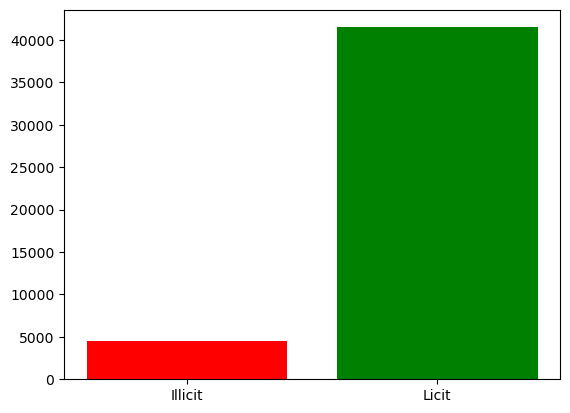

# Blockchain + ML Fraud Detection Project
### Instruction Steps

1. Please clone this repository and install env.yaml to run the notebooks.
1. The notebook runs in Python == 3.11.14 and specific dependancies version due to some packages require specific version hence follow step 1.
1. Download the link below and paste in datasets in the "data" folder. Please adjust the directory manually.

**DATASET CAN BE FOUND HERE: [Google Drive](https://drive.google.com/drive/folders/1MRPXz79Lu_JGLlJ21MDfML44dKN9R08l?usp=sharing)**

**Processed/Cleaned Dataset CAN BE FOUND HERE: [OneDrive](https://365umedumy-my.sharepoint.com/:f:/g/personal/24087626_siswa365_um_edu_my/IgBToicytg4QRpr-rlvPm4gHAR8lHN5zhMCDNKPGG0MdKZQ?e=F85Xzj)**

## Data Import

Variables to use based on mapped dataset

| Variables | Dataset Mapped |
| ---------: | --------------: |
| txs_class | txs_classes.csv |
| txs_edgelist | txs_edgelist.csv |
| txs_features |txs_features.csv |
| txaddr_edgelist | TxAddr_edgelist.csv |
| addrtx_edgelist |AddrTx_edgelist.csv |
| addraddr_edgelist | AddrAddr_edgelist.csv |
| wallet_combined | wallets_features_classes_combined.csv |

## Data Aggregation

| Dataset 1 |  Dataset 2 | Saved as |
| ---------: | --------: | -------: |
| txs_features | txs_class | df_txs |

## Data Cleaning

1. Removed 965 null values
2. Removed class 3 (unknown)

**Total cleaned size**
 Rows: 46045
 Columns: 185

## Exploratory Data Analysis

### Observing Class Imbalance

Class Proportion: 
 Licit: 90.13% 
 Illicit: 9.87%

## Data Resampling (SMOTE)

A total of 83000 new sampling created by SMOTE to address class imbalance

**Note that the sampled data does not exist any txId and solely for model training only.

**Total Cleaned Size After SMOTE**
 Total Cleaned Size After SMOTE 
     Rows:       83000 
     Columns:    184

## Note for Leo

1. Use df_preprocessed.csv to proceed with feature engineering